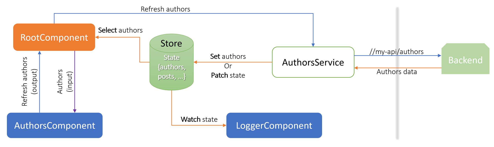

# Store Management

[](https://travis-ci.org/elie29/store)
[](https://coveralls.io/github/elie29/store?branch=master)
[](https://github.com/elie29/store)

## Frontend Application Store

A simple frontend store that manages application state using RxJS BehaviorSubject. The purpose of this store is to provide a straightforward, simple and agnostic library to manage data in any frontend application that needs to share data among services, modules or containers. By default, the store uses a shallow clone version of the state. However, we can provide another cloning strategy (eg. [lodash cloneDeep](https://lodash.com/docs/4.17.15#cloneDeep)) so the store would treat the state immutably, and any data manipulation outside the store, would not affect the store at all.



### What is a state?

In its easiest way, a state is a snapshot of an application data at a specific time. Whenever data is manipulated or changed, a new state is created and saved in the store. In our case, the state is represented by extending [State](./src/settings.ts) interface as follow:

```TS
interface BasicState extends State {
  author?: Author;
  loading: boolean;
  posts: Post[];
}
```

An initial state is a simple object that should implement BasicState as follow:

```TS
const INITIAL_STATE: BasicState = {
  author: undefined,
  loading: false,
  posts: []
}
```

### Why immutability is important?

- **Single Source of Truth**: The store is solely responsible of handling data.
- **State is read-only**: Modifying the state outside the store does not affect the store.
- **One-way dataflow**: A new state is published to subscribers any time the store receives data.
- **Predictable**: The state evolution can be tracked to figure out how and who made the changes.

## Install and Configure the Store

To get started with the store, we have two options. We can either download the latest release or run npm install:

- Download the [latest release](https://github.com/elie29/store/releases) and include it as a lib to the project
- Run `npm install @eli29/store`
- Optionally run
  - `npm install rxjs`: If it is not installed already
  - `npm install lodash`: If you want to use cloneDeep and not installed already

Once the store dependencies installed, we need to:

1. Define application state (cf. BasicState)
2. Create initial state (cf. INITIAL_STATE)
3. Extend abstract store class as follow:

```TS
export class BasicStore extends Store<BasicState> {
  constructor() {
    super(INITIAL_STATE);
  }
}
```

### Settings

By default, we don't log state changes and we use a shallow clone strategy function. We can change these settings by providing a [StoreSettings](./src/settings.ts) to the constructor as follow:

```TS
export class BasicStore extends Store<BasicState> {
  constructor() {
    super(INITIAL_STATE, {
      logChanges: true,
      cloneStrategy: <T>(value: T): T => ({ ...value })
    });
  }
}
```

Now BasicStore could be injected in any service or container. It is also possible to :

1. create an instance of the store in order to be shared across the application.
2. create for each module its own instance of store.

Store instances are isolated and does not share any data between them.

### Store Management in Angular Service

```TS
@Injectable({
  providedIn: 'root' // or in a module specific providers
})
export class BasicStore extends Store<BasicState> {
  constructor() {
    super(INITIAL_STATE);
  }
}
```

## Store API

The store Api is very simple and contains few public methods:

1. **value**: A getter for the current cloned state. Any manipulation of this value does not affect the store.
1. **get**: Retrieve a specific key from the state: eg. get('author') or get('loading').
1. **set**: Update a specific state key in the store: eg. set('loading', true).
1. **patch**: Update the state or a slice of the state.
1. **select**: Watch for a value change of a specific key in the store. It returns an observable of readonly data. eg. select('author').subscribe(next => console.log(next)).
1. **watch**: Watch and keep track on store changes.

N.B.: By default, data passed or retrieved from the store is **NOT** deep cloned. So any manipulation of data DOES affect the store unless we implement lodash cloneDeep function which is highly recommended.

## Peer Dependencies

The store management library depends on:

1. RxJS ^6.3

   - BehaviorSubject, Observable
   - distinctUntilChanged, map, pluck

2. lodash [recommended but not required]

   - cloneDeep

## Publish to npm repo

1. Increment version number in package.json and package-lock.json
1. Run `npm run pub` then enter the 2FA code
1. Commit, push and create a new github release
